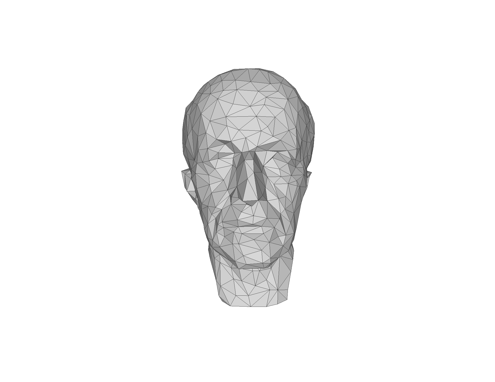
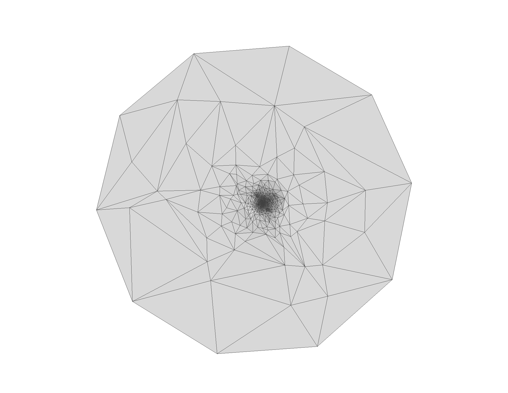

# mesh parameterization
メッシュのパラメータ化に関するプログラム

入力したメッシュを円盤に写すことができます．

入力：　円盤と同相なメッシュ（off形式）

出力：　円盤に移した結果（off形式）

   

  <em>元となるメッシュ（左），円盤に移した結果（右）</em> 

現在３種類：
tuttle埋め込み，重心座標を利用したパラメータ化（２種類）

使用しているライブラリ：Eigen
