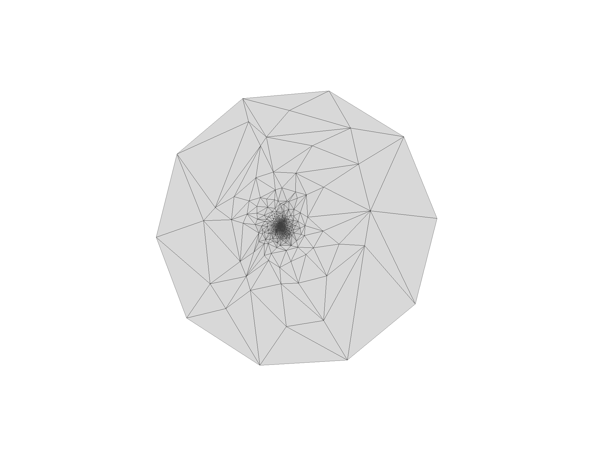

# mesh parameterization
メッシュのパラメータ化に関するプログラム

入力したメッシュを円盤に写すことができます．

入力：　円盤と同相なメッシュ（off形式）

出力：　円盤に移した結果（off形式）

実行例
```
g++ param_lap.cpp -o param_lap -std=c++17 -I /usr/local/.../include/eigen3
  ./param_lap sample.off
```
<p>
  
  

  <em>元となるメッシュ（上），円盤に写した結果（下）</em> 
</p>

現在３種類：
tuttle埋め込み，重心座標を利用したパラメータ化（２種類）

使用しているライブラリ：Eigen
